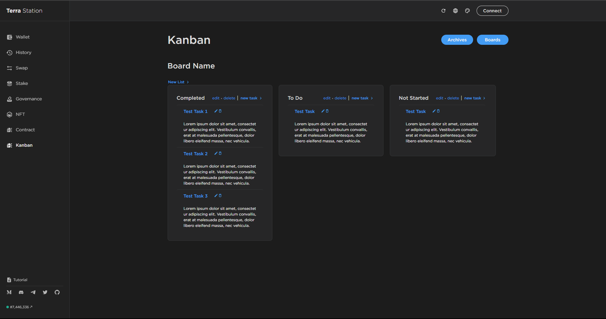

# Terra Station Kanban



**Terra Station Kanban** Is a draggable kanban board purposefully built to be a seemlessly integration into the [Terra Station](https://github.com/terra-money/station) architecture. It follows design patterns and technolgies used as a means to be reusable and updateable by anyone familiar with the architecture.

Built as an inspiration from [Terra Screening](https://github.com/terra-money/screening-test-frontend/blob/master/README.md)

**Terra Station Kanban** is still in developement and will receive regular updates to improve user experience and additional functionality.

## Running Terra Station Kanban

Run Terra Kanban Screening with the following commands:

```
git clone https://github.com/HunterSides/terra-screening.git
cd terra-screening
npm i
npm run start
```

Runs the app in development mode.
Open http://localhost:3000 to view it in the browser.

## Future Updates to include

- Additional UX improvements
- Editable list & task details
- Handling and creation of multiple Boards & Archives page
- Further code-splitting
  > Note: For the Windows operating system, separate the paths by semicolons in the `.env` file.
